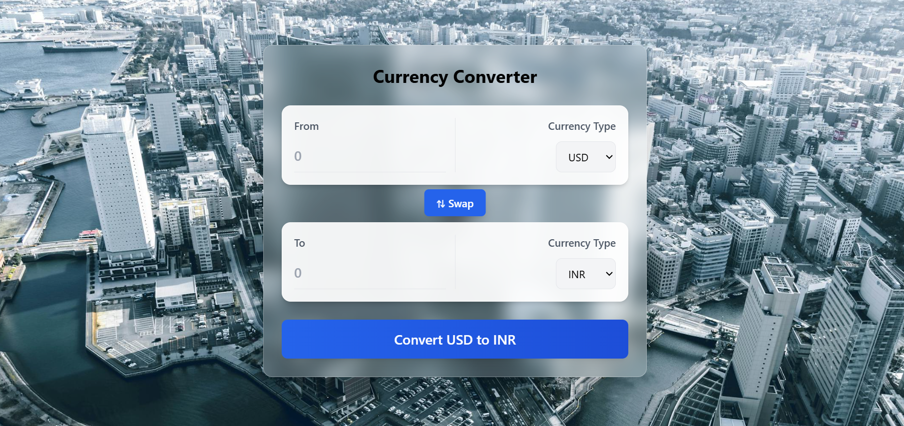

# 💱 Currency Converter

A modern, responsive currency converter built with React, Vite, and Tailwind CSS. Convert between different currencies with real-time exchange rates and a beautiful glassmorphism UI design.

<div align="center">
  
</div>

## 🎯 Live Demo

Experience the live application with real-time currency conversion and beautiful glassmorphism design.

## ✨ Features

- 🔄 **Real-time Exchange Rates** - Fetches live currency data from API Layer
- 🌍 **Multiple Currencies** - Support for major world currencies
- ↕️ **Currency Swap** - Quick swap between "from" and "to" currencies
- 🎨 **Modern UI** - Beautiful glassmorphism design with backdrop blur effects
- 📱 **Responsive Design** - Works seamlessly on desktop and mobile devices
- ⚡ **Auto-conversion** - Automatically converts as you type
- 🚀 **Fast Performance** - Built with Vite for lightning-fast development and builds

## 🛠️ Tech Stack

- **Frontend Framework**: React 19.1.0
- **Build Tool**: Vite 7.0.3
- **Styling**: Tailwind CSS 3.4.17
- **API**: API Layer Currency Exchange API
- **Deployment**: Ready for Vercel, Netlify, or any static hosting

## 🚀 Getting Started

### Prerequisites

- Node.js (version 14 or higher)
- npm or yarn package manager

### Installation

1. **Clone the repository**
   ```bash
   git clone https://github.com/yourusername/currency-converter.git
   cd currency-converter
   ```

2. **Install dependencies**
   ```bash
   npm install
   ```

3. **Start the development server**
   ```bash
   npm run dev
   ```

4. **Open your browser**
   
   Navigate to `http://localhost:5173` to see the application running.

## 📁 Project Structure

```
currencyconverter/
├── public/
│   └── vite.svg
├── src/
│   ├── components/
│   │   ├── InputBox.jsx       # Reusable input component for currency selection
│   │   └── index.js           # Component exports
│   ├── hooks/
│   │   └── useCurrencyInfo.js # Custom hook for fetching currency data
│   ├── assets/
│   │   └── react.svg
│   ├── App.jsx                # Main application component
│   ├── main.jsx               # Application entry point
│   └── index.css              # Global styles and Tailwind imports
├── package.json
├── vite.config.js
├── tailwind.config.js
└── README.md
```

## 🔧 Available Scripts

| Command | Description |
|---------|-------------|
| `npm run dev` | Start development server |
| `npm run build` | Build for production |
| `npm run preview` | Preview production build |
| `npm run lint` | Run ESLint for code quality |

## 🎯 Key Components

### InputBox Component
A reusable component that handles:
- Amount input with number validation
- Currency selection dropdown
- Conditional disabling for converted amount display
- Responsive design with glassmorphism styling

### useCurrencyInfo Hook
A custom React hook that:
- Fetches real-time currency exchange rates
- Uses USD as the base currency
- Handles API responses and data formatting
- Provides currency conversion rates to components

## 🔄 How It Works

1. **Data Fetching**: The app uses the API Layer service to fetch live exchange rates with USD as the base currency
2. **Conversion Logic**: 
   - USD to other currencies: `amount × rate`
   - Other currencies to USD: `amount ÷ rate`
   - Between non-USD currencies: Convert to USD first, then to target currency
3. **Real-time Updates**: Exchange rates update automatically, and conversions happen as you type
4. **Currency Swap**: Instantly swap the "from" and "to" currencies with the swap button

## 🎨 Design Features

- **Glassmorphism UI**: Modern glass-like effect with backdrop blur
- **Gradient Backgrounds**: Beautiful gradient overlays and buttons
- **Smooth Animations**: Hover effects and transitions for better UX
- **Responsive Layout**: Adapts to different screen sizes seamlessly
- **Professional Typography**: Clean, readable fonts with proper hierarchy

## 🌐 API Integration

This project uses the [API Layer Currency Exchange API](https://apilayer.net/api) for real-time exchange rates. The free tier provides:
- 1000 API requests per month
- Real-time exchange rates
- 168+ supported currencies

## 🚀 Deployment

### Deploy to Vercel
1. Push your code to GitHub
2. Connect your repository to Vercel
3. Deploy with default settings

### Deploy to Netlify
1. Build the project: `npm run build`
2. Deploy the `dist` folder to Netlify

## 🤝 Contributing

Contributions are welcome! Please feel free to submit a Pull Request. For major changes, please open an issue first to discuss what you would like to change.

1. Fork the project
2. Create your feature branch (`git checkout -b feature/AmazingFeature`)
3. Commit your changes (`git commit -m 'Add some AmazingFeature'`)
4. Push to the branch (`git push origin feature/AmazingFeature`)
5. Open a Pull Request

## 🙏 Acknowledgments

- [API Layer](https://apilayer.net/) for providing the currency exchange API
- [Pexels](https://www.pexels.com/) for the beautiful background image
- [Tailwind CSS](https://tailwindcss.com/) for the utility-first CSS framework
- [Vite](https://vitejs.dev/) for the fast build tool and development experience

## 📧 Contact

Your Name - [@yourusername](https://twitter.com/AdityaRoy134679) - adityaroyofficial20@gmail.com

Project Link: [https://github.com/Adityaroy000/currency-converter](https://github.com/Adityaroy000/currency-converter)

---

⭐ If you found this project helpful, please give it a star on GitHub!
